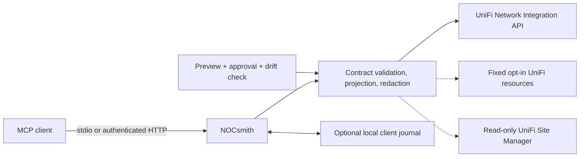

<div align="center">

# NOCsmith

**Network intelligence, forged safely.**

*by Clint*

A security-first Model Context Protocol server for operating and understanding
UniFi Network.

Give AI assistants structured access to network inventory, diagnostics, history,
and carefully controlled changes—without turning your controller into an
open-ended API proxy.


</div>

## What it is

NOCsmith connects MCP-compatible assistants to a self-hosted UniFi Network
controller. It exposes 37 purpose-built tools for reading network state,
investigating client behavior, reviewing configuration, and applying approved
changes.

The official UniFi Network Integration API remains authoritative. Optional
private reads are narrowly fixed, bounded, projected, and provenance-labelled
for the few useful fields the official contract does not expose. Callers never
receive an arbitrary URL, raw private response, controller session, or database
connection.

This project is designed for private, operator-controlled deployments. It is
not affiliated with or endorsed by Ubiquiti.

## Network superpowers

| Mission | What NOCsmith does |
| --- | --- |
| Map the control plane | Builds source-aware snapshots across sites, devices, clients, networks, Wi-Fi, switching, firewall, ACL, DNS, VPN, WAN, vouchers, and traffic policy |
| Hunt RF ghosts | Correlates a client with its AP and radio, then exposes RSSI, SNR, noise, PHY rates, MCS/NSS, retries, channel utilization, transmit power, roaming, and DHCP/APIPA evidence |
| Find the bandwidth hogs | Ranks authoritative currently connected clients by nullable source-relative traffic counters while suppressing unverified upload/download and rate semantics |
| Inspect a switch trunk | Combines official link and PoE state with bounded private port configuration, resolved native/tagged networks, applied profiles, and live watt draw |
| Reconstruct client timelines | Reconciles authoritative current state, bounded controller history, and configured groups—or records explicit observations in a local SQLite journal for later change queries |
| Audit intent versus reality | Surfaces missing fields, partial sources, configuration references, ungrouped clients, firmware state, and topology caveats without inventing certainty |
| Watch the whole fleet | Adds optional read-only Site Manager inventory, console health, firmware/update state, and historical ISP metrics |
| Execute guarded changes | Turns a proposed mutation into an exact preview, short-lived confirmation capability, live drift check, and one non-retried apply |
| Run inside your trust boundary | Speaks local stdio or authenticated stateless Streamable HTTP, including a hardened Unix-socket path behind Tailscale Serve |

## Safety by design

- **Allowlisted operations.** Normal calls must exist in a reviewed OpenAPI
  contract. Private adapters use fixed resources and explicit output fields.
- **Human-gated writes.** Every controller mutation is previewed first and
  bound to a random, single-use, five-minute confirmation capability.
- **State-drift protection.** Apply rechecks relevant live state and rejects a
  stale preview.
- **Data minimization.** Private responses are projected, bounded, recursively
  redacted, and labelled with source and observation metadata.
- **No connector-managed credential store.** Credentials can be injected from
  a protected environment file or secret manager; they do not belong in MCP
  configuration, source control, tool output, or the journal.
- **Fail-closed semantics.** Partial, contradictory, unsupported, or
  version-specific data is not silently promoted to authoritative state.
- **Hardened deployment.** The tracked container runs non-root and read-only,
  drops all Linux capabilities, and exposes no LAN port.

Read the concise [security policy](SECURITY.md) or the full
[threat model](docs/threat-model.md).

## How it fits together



## Quick start

### Requirements

- .NET SDK 10
- A UniFi Network Integration API key
- HTTPS access to a UniFi OS Network Integration API endpoint
- An MCP client such as Codex

Create the API key in **Network → Settings → Control Plane → Integrations**.
Provide these values through a protected environment file or secret manager:

```dotenv
UNIFI_API_KEY=replace-with-secret
UNIFI_BASE_URL=https://unifi.example.com/proxy/network/integration
UNIFI_ENABLE_LEGACY_READ_ENRICHMENT=false
UNIFI_ENABLE_CLIENT_JOURNAL=false
```

`.env.example` documents every supported setting. Do not commit a resolved
environment file.

Build and test:

```sh
dotnet restore --locked-mode
dotnet build UnifiMcp.slnx --configuration Release --no-restore
dotnet test UnifiMcp.slnx --configuration Release --no-restore
```

The release workflow publishes stable images to GitHub Container Registry for
both `linux/amd64` and `linux/arm64`:

```sh
docker pull ghcr.io/clintbnyc/unifi-mcp:1.3.0
```

The package is private by default. Authorized consumers can sign in with a
classic GitHub personal access token scoped only to `read:packages`; if the
package is later made public, pulls no longer require authentication. Prefer a
published `sha256` digest when pinning a deployment. See the
[operations reference](docs/operations.md#github-container-registry) for tag,
authentication, visibility, and release details.

Validate configuration, TLS, API access, contract selection, and enabled
features without printing secrets:

```sh
dotnet run --project src/UnifiMcp --configuration Release --no-build -- \
  --env-file=/absolute/path/to/protected.env doctor
```

Run the stdio MCP server:

```sh
dotnet run --project src/UnifiMcp --configuration Release --no-build -- \
  --env-file=/absolute/path/to/protected.env
```

For a durable local publish, Streamable HTTP, Tailscale Serve, Docker, or the
production rollback procedure, use the [operations reference](docs/operations.md).

## Tool families

The server exposes 37 tools grouped around operator intent:

- **Discover:** capabilities, site snapshots, sites, and supporting resources
- **Observe:** devices, clients, networks, Wi-Fi, switching, firewall, ACL,
  DNS, traffic lists, hotspot vouchers, and System Log alerts
- **Diagnose:** current Wi-Fi RF/DHCP diagnostics, bounded client-traffic
  rankings, switch-port configuration/PoE enrichment, and client-group audits
- **Remember:** explicit client collection, change queries, per-client history,
  journal health, and fingerprint-bound recovery
- **See the fleet:** Site Manager inventory and ISP metrics
- **Change safely:** domain previews, a generic allowlisted preview, and one
  confirmation-bound apply tool

Use `unifi_get_capabilities` to inspect the live contract, enabled optional
features, coverage limitations, and exact operation inventory.

## Optional capabilities

Private reads, Site Manager, the client journal, and scheduled collection are
off unless configured. The main feature gates are:

```dotenv
UNIFI_ENABLE_LEGACY_READ_ENRICHMENT=true
UNIFI_SITE_API_KEY=replace-with-separate-read-only-key
UNIFI_ENABLE_CLIENT_JOURNAL=true
UNIFI_CLIENT_JOURNAL_DB_PATH=/absolute/private/path/client-journal.db
UNIFI_ENABLE_SCHEDULED_COLLECTION=true
```

The private-read gate enables only reviewed fixed resources. The journal is a
separate local data grain and is not encrypted by the connector; protect its
host volume and directory permissions. See the operations reference for exact
limits, retention, provenance, and recovery behavior.

## Compatibility

NOCsmith currently retains `unifi-mcp` as its executable, MCP server ID,
container/image name, repository slug, and deployment namespace. Existing
configuration and automation therefore continue to work without migration.

- Runtime: .NET 10
- MCP transports: stdio and stateless Streamable HTTP
- Embedded fallback contract: UniFi Network 10.5.67
- Local API: official Network Integration API over validated HTTPS
- Optional cloud API: UniFi Site Manager stable v1, read-only
- Journal: SQLite WAL on a private local filesystem

At startup the connector probes the live application and controller contract.
A validated, exactly version-matched controller contract may supplement
bounded response-schema capability detection, while operation IDs, methods,
paths, parameters, and request schemas always remain restricted to the
reviewed embedded contract.

## Documentation

| Document | Purpose |
| --- | --- |
| [Operations reference](docs/operations.md) | Full configuration, private-read semantics, journal behavior, deployment, rollback, and Codex registration |
| [Security policy](SECURITY.md) | Supported versions, vulnerability reporting, and security guarantees |
| [Threat model](docs/threat-model.md) | Assets, actors, trust boundaries, attacker stories, mitigations, and severity calibration |
| [.env.example](.env.example) | Supported environment variables without resolved secrets |

## Development

The repository uses locked NuGet dependencies, warnings-as-errors, a vendored
OpenAPI contract, and complete Release tests. Before opening a pull request:

```sh
dotnet format UnifiMcp.slnx --no-restore
dotnet test UnifiMcp.slnx --configuration Release --no-restore
git diff --check
```

Security-sensitive changes should update the threat model when they add a
transport, authentication mode, upstream API, write category, persistent data
field, deployment boundary, or secret-handling path.
